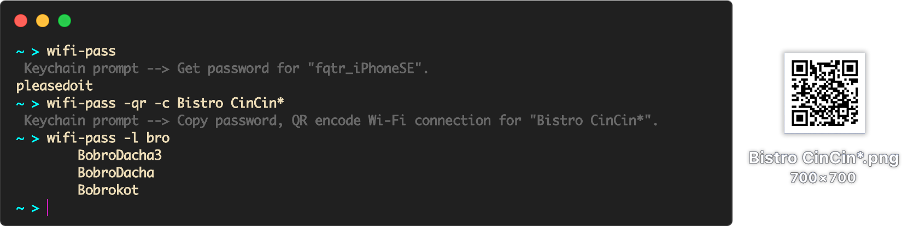

<h1 align="center">wifi-pass</h1>

<p align="center"><a href="#install"></a> <a href="//travis-ci.org/DaFuqtor/wifi-pass"></a> <a href="https://github.com/DaFuqtor/wifi-pass/blob/master/wifi-pass.sh"></a></p>

<p align="center"><b>Bash tool to QR encode, copy or just get the password of current Wi-Fi connection</b></p>

<p><a href="https://github.com/DaFuqtor/wifi-pass/commits/master"></a> <a href="https://github.com/DaFuqtor/wifi-pass/blob/master/LICENSE"></a></p>

[](https://raw.githubusercontent.com/DaFuqtor/wifi-pass/master/preview.png)

## Usage

```powershell
wifi-pass [-hV] [options] [<ssid>]
          [-u,  --update]    # Check for update and ask to install
        # Options:
          [-c,  --copy]      # Copy the password to clipboard
          [-qr, --qrencode]  # Create QR-code for Wi-Fi connection
          [-l,  --list]      # Display a list of all stored networks
```

- SSID left empty means **current Wi-Fi network**

- Using **without options** just outputs password

## Install

### Using [Homebrew](//brew.sh)

```powershell
brew install dafuqtor/tap/wifi-pass
```

### Using `curl`

```powershell
curl wifi-pass.ru | sh
```

### Using Source Code

```powershell
git clone https://github.com/DaFuqtor/wifi-pass
cd wifi-pass
make
```

> Also allows to `make [ upgrade, uninstall ]`
